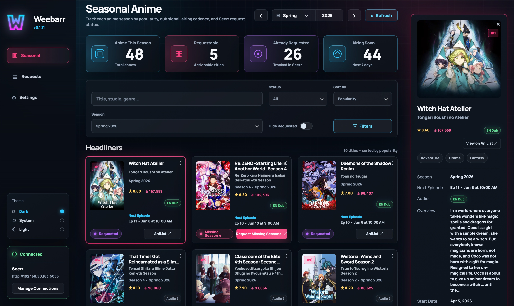
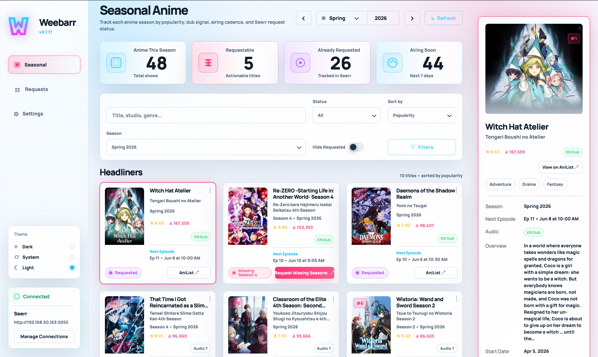

<div align="center">


**Seasonal anime discovery and Seerr request management**

[](LICENSE)
[](https://www.python.org/downloads/)
[](https://www.docker.com/)
[](https://github.com/DeepDaddyTTV/weebarr/pkgs/container/weebarr)

</div>

Weebarr helps self-hosted anime libraries stay ahead of each release season. It pulls seasonal anime from AniList, ranks and groups shows by popularity, resolves titles against Seerr/TMDB, and lets you request TV anime directly into Seerr.

<p align="center">
  
  
</p>

<p align="center"><em>Dark mode</em> and <em>light mode</em> dashboard captures from the live app.</p>

## Why Weebarr?

- **Seasonal discovery**: Browse current and upcoming anime seasons without manually hunting through multiple anime sites.
- **Popularity-first triage**: Group shows into S-Tier, Canon, Bingeable, and Filler using AniList popularity.
- **Seerr-native requests**: Request matched TV anime through Seerr so your existing Sonarr anime profile, root folder, and approval flow stay in control.
- **Status-aware cards**: See whether a title is requestable, already requested, available, partially available, or missing a Seerr/TMDB match.
- **Audio signal badges**: Shows a best-effort English dub/source-language badge using AniList origin data and cached MAL voice-actor data from Jikan.
- **Self-hosted friendly**: Runs as a small FastAPI container with static frontend assets and environment-based configuration.

## Quick Start

```yaml
services:
  weebarr:
    image: ghcr.io/deepdaddyttv/weebarr:latest
    container_name: weebarr
    environment:
      TZ: UTC
      SEERR_BASE_URL: http://seerr:5055
      SEERR_API_KEY: your-seerr-api-key
    ports:
      - "8080:8888"
    volumes:
      - ./config:/config
    restart: unless-stopped
```

Open `http://localhost:8080`.

On a brand-new install, Weebarr starts with a first-run access wizard. You can choose a Sonarr-style local account or Plex Auth, then add an app API key later if you want automation access to `/api/*`.

## Configuration

Weebarr is configured with environment variables so it works cleanly in Docker Compose, Portainer, Unraid, and similar self-hosted setups.

| Variable | Default | Description |
| --- | --- | --- |
| `WEEBARR_HOST` | `0.0.0.0` | Host interface Weebarr binds to inside the container. |
| `WEEBARR_PORT` | `8888` | Container listen port. |
| `WEEBARR_LOG_LEVEL` | `INFO` | Uvicorn/application log level. |
| `WEEBARR_CONFIG_PATH` | auto | Override the persisted JSON settings path. Defaults to `/config/weebarr.json` when writable. |
| `WEEBARR_AUTH_MODE` | `disabled` | Optional env-first override for access mode. Supports `disabled`, `local`, `plex`, or `both`. Most installs can leave this unset and use the first-run setup flow instead. |
| `WEEBARR_AUTH_USERNAME` | none | Local-auth username when bootstrapping through environment variables instead of the first-run setup UI. |
| `WEEBARR_AUTH_PASSWORD` | none | Local-auth password when bootstrapping through environment variables instead of the first-run setup UI. |
| `WEEBARR_AUTH_PASSWORD_HASH` | none | Optional hashed alternative to `WEEBARR_AUTH_PASSWORD` for env-managed local auth. |
| `WEEBARR_SESSION_SECRET` | none | Session signing secret. Required for env-managed local or Plex auth, but generated automatically when you complete the first-run setup flow. |
| `WEEBARR_PUBLIC_URL` | request host | Optional public URL used for Plex callback redirects. |
| `WEEBARR_API_KEY` | none | Optional app API key for non-browser automation access to `/api/*`. |
| `WEEBARR_API_KEY_HASH` | none | Optional hashed alternative to `WEEBARR_API_KEY` for env-managed automation auth. |
| `WEEBARR_API_KEY_PREVIEW` | none | Optional masked preview string shown in the UI when using env-managed hashed API keys. |
| `WEEBARR_PLEX_ALLOWED_USERS` | none | Optional comma-separated Plex username/email allowlist. |
| `WEEBARR_CONTENT_FILTER_MODE` | `hide_nsfw` | Seasonal content filter. Supports `hide_nsfw` (AniList adult-only titles hidden) or `show_all`. |
| `WEEBARR_STRICT_MONITORING` | `false` | When enabled, later sequel seasons are treated as `Season Missing` unless that specific season is explicitly present or requested in Seerr. |
| `SEERR_BASE_URL` | none | Seerr base URL, for example `http://seerr:5055`. |
| `SEERR_API_KEY` | none | Seerr API key. Required for request/status integration. |
| `SEERR_REQUEST_SEASONS` | `all` | Request mode for unmatched season-specific titles. Supports `all`, `first`, or `latest`, and Weebarr resolves that into real season numbers before calling Seerr. |
| `SEERR_SONARR_SERVER_ID` | Seerr default | Optional Sonarr server override. |
| `SEERR_PROFILE_ID` | Seerr anime/default profile | Optional Sonarr quality/profile override. |
| `SEERR_ROOT_FOLDER` | Seerr anime/default root | Optional root-folder override sent with request payloads. |
| `SEERR_LANGUAGE_PROFILE_ID` | none | Optional language profile override for older Sonarr setups. |
| `SEERR_REQUEST_USER_ID` | API key user | Optional Seerr user ID to request as. |
| `SEERR_TAGS` | none | Optional comma-separated Seerr/Sonarr tag IDs. |
| `SEERR_CACHE_TTL_SECONDS` | `900` | Seerr search/details/settings cache TTL. |
| `REQUEST_TIMEOUT_SECONDS` | `20` | HTTP timeout for AniList, Seerr, and Jikan calls. |
| `ANILIST_CACHE_TTL_SECONDS` | `21600` | AniList seasonal cache TTL. |
| `AUDIO_LOOKUP_ENABLED` | `true` | Enables cached Jikan lookups for English voice-actor/dub detection. |
| `AUDIO_CACHE_TTL_SECONDS` | `86400` | Audio lookup cache TTL. |
| `AUDIO_LOOKUP_TIMEOUT_SECONDS` | `6` | Per-title timeout for Jikan audio metadata lookups. |

## Local Development

```bash
python3 -m venv .venv
. .venv/bin/activate
pip install -r requirements.txt
WEEBARR_PORT=8080 SEERR_BASE_URL=http://localhost:5055 SEERR_API_KEY=change-me python -m src.main
```

Run tests:

```bash
pytest tests/unit
```

## Notes

- AniList powers seasonal metadata and popularity sorting.
- Weebarr’s first-run setup writes access settings into the mounted config volume, so you can keep the container image generic and finish auth/API configuration from the UI.
- Local UI sessions use signed cookies, and non-browser automation can use the generated app API key by sending `X-API-Key: <key>` or `Authorization: Bearer <key>`.
- The `Hide NSFW` setting follows AniList's adult-only flag. Weebarr also treats older `adult_only` config values as `hide_nsfw` so existing installs keep working.
- Seerr powers TV matching, request status, and request creation.
- Jikan/MAL voice-actor data powers the best-effort `EN Dub` badge. If no English voice actors are found, Weebarr falls back to origin labels like `JA only` or `CH only`.
- If Weebarr cannot confidently match a title through Seerr search, it will show the title as missing mapping instead of creating a risky request.

## License

GPL-3.0. See [LICENSE](LICENSE).
