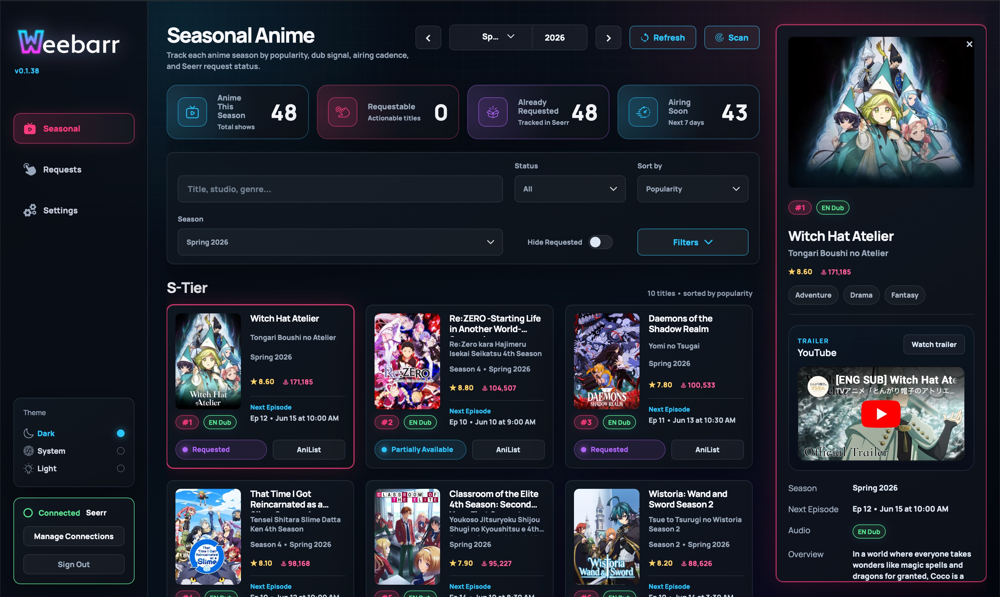
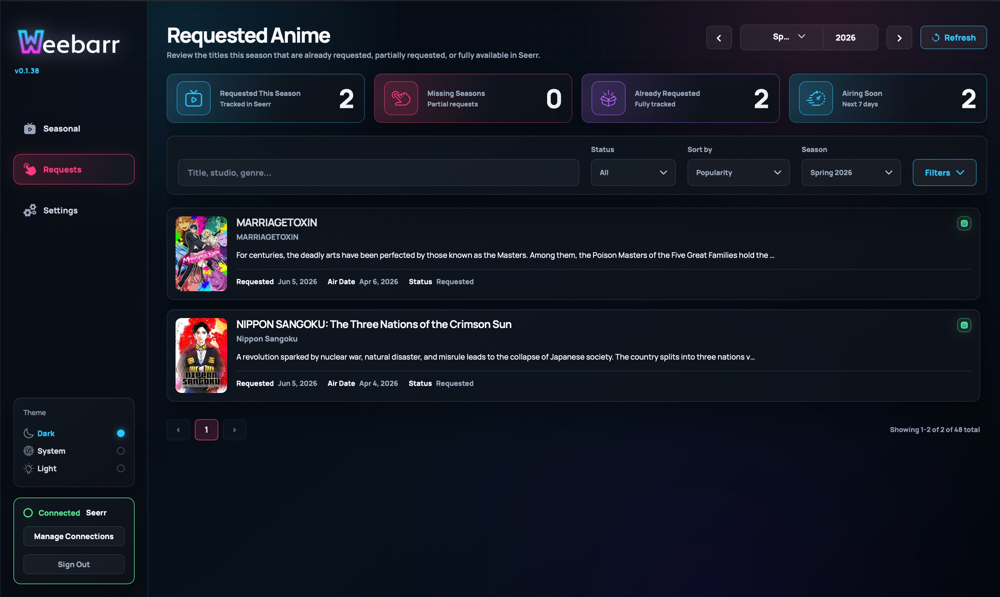
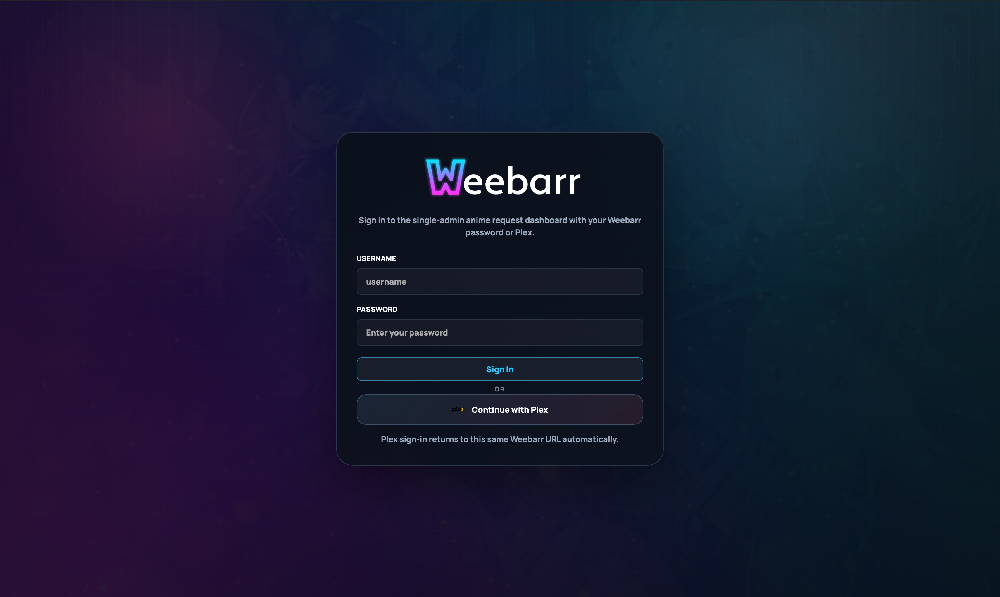

# Feature Reference

This page explains what Weebarr does from a normal user point of view. It is not meant to be a developer map of every internal part. Think of it as the app tour.

## Seasonal Page

The **Seasonal** page is the main dashboard.

This is where you browse anime by season, see what is already available, and request anything you want Seerr to handle.

You can use it to:

- choose a season and year
- refresh seasonal data
- run an automation scan manually
- search for a title
- filter by status
- sort the list
- see how many titles are requestable, requested, tracked, or airing soon

## Seasonal Buckets

Weebarr groups anime into simple quality buckets:

- `S-Tier`
- `Canon`
- `Bingeable`
- `Filler`

These are meant to make the seasonal list easier to scan. You can treat them as “watch first,” “probably worth it,” “fine for later,” and “low priority.”

Automation can also use these buckets, so be careful before enabling auto-requesting for a bucket you do not actually want.

## Anime Cards

Each anime appears as a card.

Depending on the available data, a card may show:

- poster art
- title
- alternate title
- season label
- AniList score
- AniList popularity
- next episode timing
- audio badge, such as `EN Dub` or `EN Sub`
- availability state
- request button
- AniList link

The card is meant to answer the quick question: “What is this, and do I need to do anything with it?”

## Expanded Details

Selecting a card opens more information.

On desktop, this appears in a side panel. On mobile, the card expands in place.

The detail view can include:

- larger poster or banner art
- title and subtitle
- rank and audio badges
- score and popularity
- genres
- trailer
- summary
- next airing information
- start date
- Seerr match details
- availability status
- cast and voice actor information from AniList

Use this view when you are deciding whether a show is worth requesting.

## Requests Page

The **Requests** page shows requests made through Weebarr.

It is not a full copy of your Seerr request history. If you requested something directly in Seerr, it may not appear here.

Each row can show:

- poster
- title
- short description
- request date
- air date
- current Weebarr or Seerr status

Use this page to answer: “What did I request from Weebarr?”

## Availability States

Weebarr uses availability states to explain what it found in Seerr.

### `Available`

The required season or seasons appear to be available in Seerr.

### `Partially Available`

Seerr knows about the show, and at least some required season coverage exists. This usually means the title is not totally missing, but it may not be fully complete either.

### `Requested`

A request exists, but Weebarr does not see enough availability yet to call it partially or fully available.

### `Missing`

Weebarr does not see a usable request or tracked entry for the title yet.

This is usually the state you will request from.

### `Season Missing`

Strict Monitoring is enabled, and Weebarr sees that a later season is not explicitly covered.

This is useful if you care about sequel seasons being tracked individually instead of assuming the base show is enough.

### `No Seerr match`

Weebarr could not confidently match the anime to a TV entry in Seerr or TMDb.

This can happen when names, metadata, or external IDs do not line up cleanly.

## Audio Badges

Weebarr tries to show whether a title has English dub information.

Possible badges include:

- `EN Dub`
- `EN Sub`

This is best-effort. Weebarr uses AniList information and cached MAL/Jikan voice actor data when available.

If Weebarr cannot find English voice actor data, it falls back to `EN Sub`.

Do not treat the badge as a perfect streaming availability guarantee. Treat it as a helpful hint.

## Requesting Anime

Weebarr sends TV requests through Seerr.

That means:

- Weebarr does not send requests directly to Sonarr.
- Seerr remains the request gatekeeper.
- Your Seerr anime/default settings are used unless you override them in Weebarr.

Optional settings can force specific request values, such as:

- Sonarr server
- quality profile
- series type
- root folder
- language profile
- request user
- tags

For most users, `Use Seerr default` is the safest choice. Only force values if you know why you need them.

## Automation

Automation can request seasonal titles for you.

You choose which buckets are allowed, then Weebarr scans on the cadence you save.

Automation only requests titles in these states:

- `Missing`
- `Season Missing`

Automation skips titles that are already:

- `Requested`
- `Partially Available`
- `Available`

That skip behavior is intentional. It helps avoid duplicate requests and noisy re-processing.

You can run automation manually from the Seasonal page or let it run on the saved schedule.

## Themes

Weebarr includes built-in themes:

- `Neon Lights`
- `Monochrome`
- `Color Picker`

It can also import community themes, but only as validated theme token packs.

Theme imports are not raw CSS or JavaScript. That keeps themes safer and easier to maintain.

## Login and Access

Weebarr is designed as a single-admin app.

You can use:

- local username and password
- Plex login
- both local and Plex login

If both are enabled, either login method can be used.

## Security Basics

Weebarr includes several guardrails:

- first-run setup protection
- public URL pinning for Plex callback behavior
- signed sessions
- optional automation API key
- limited API key permissions
- rate limiting around setup, login, and Plex auth starts

Even with those protections, you should still put Weebarr behind HTTPS if exposing it outside your home network.
