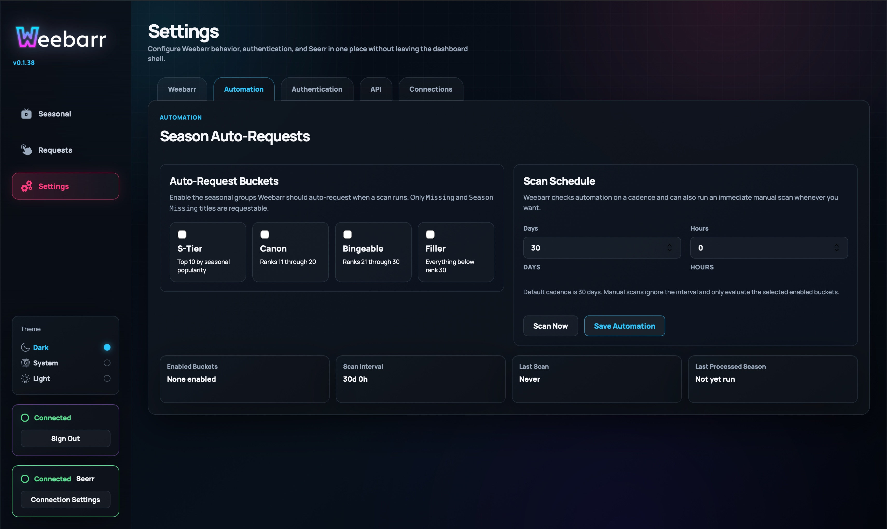
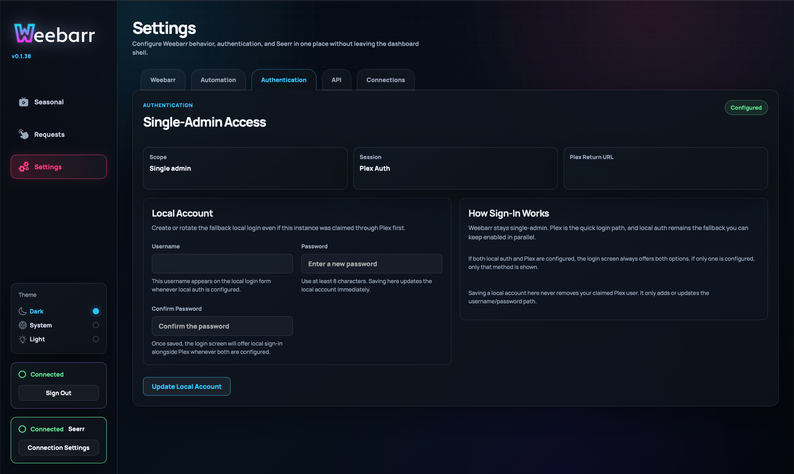
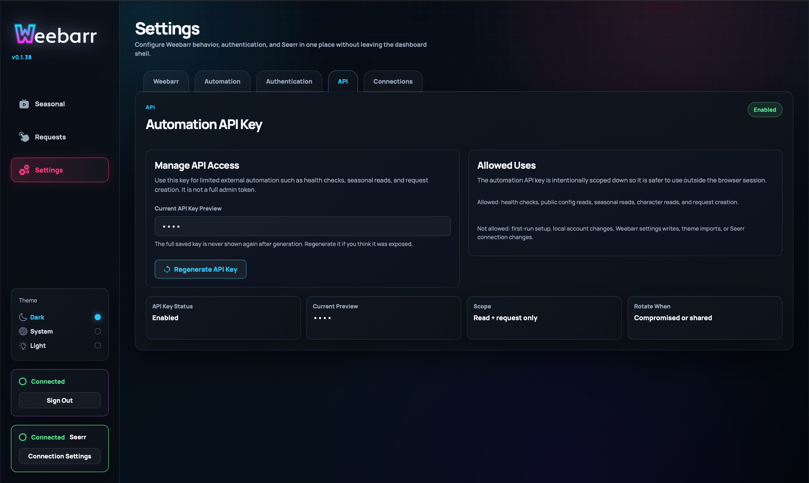
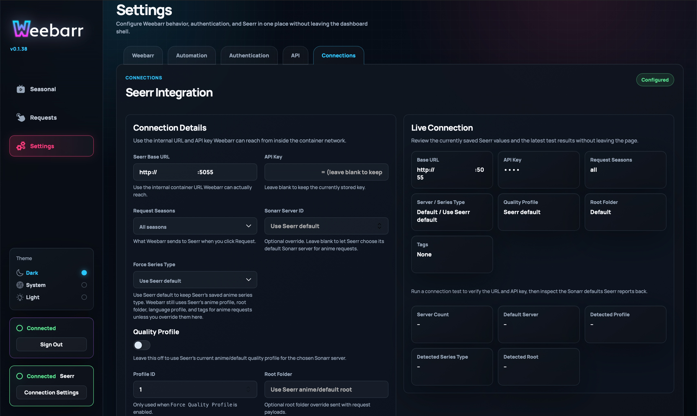

# Settings Reference

The Settings page controls how Weebarr looks, logs in, scans for anime, exposes API access, and talks to the active request backend.

Most users only need to configure the **Connections** tab first. The other tabs can be adjusted later.

## Settings Tabs

The Settings page has five tabs:

- **Weebarr**
- **Automation**
- **Authentication**
- **API**
- **Connections**

## Weebarr Tab

The **Weebarr** tab controls general app behavior.


### Theme Mode

Theme Mode controls light and dark behavior for your current browser.

Options:

- `Dark`
- `System`
- `Light`

This is browser-local. Changing it on one device does not necessarily change it everywhere else.

### Named Theme

Named Theme controls the theme used by the Weebarr instance.

Built-in themes include:

- `Neon Lights`
- `Monochrome`
- `Color Picker`

Imported themes appear here after they are added successfully.

### Theme Import

You can import a theme by using either:

- a direct URL to a `theme.json` file
- a `.zip` file that contains a valid `theme.json`

Weebarr only accepts validated theme token manifests. It does not accept random CSS, JavaScript, or loose asset files.

### Content Filter

The Content Filter controls whether AniList adult-only titles are hidden.

Options:

- `Hide NSFW`
- `Show all`

For most shared or family-facing dashboards, `Hide NSFW` is the safer default.

### Strict Monitoring

Strict Monitoring changes how Weebarr handles sequel seasons.

When Strict Monitoring is off, Weebarr may treat later seasons as partly covered if the base show already exists in Seerr.

When Strict Monitoring is on, later seasons need more explicit coverage. If a sequel season is not covered, Weebarr may show it as `Season Missing`.

Use Strict Monitoring if you want Weebarr to be more careful with sequels.

## Automation Tab

The **Automation** tab controls auto-requesting.

Automation is optional. You can use Weebarr manually without enabling it.



### Enabled Buckets

You can choose which seasonal buckets automation is allowed to request from:

- `S-Tier`
- `Canon`
- `Bingeable`
- `Filler`

Only enable buckets you are comfortable auto-requesting. If you do not want low-priority shows requested automatically, leave `Filler` off.

### Scan Cadence

The cadence controls how often automation scans.

It is saved as:

- `Days`
- `Hours`

Rules:

- days can be `0` through `365`
- hours can be `0` through `23`
- `0 days / 0 hours` is not valid

Example cadences:

- `1 day / 0 hours` means once a day
- `0 days / 12 hours` means twice a day
- `7 days / 0 hours` means once a week

### Scan Actions

The Automation tab includes actions such as:

- `Save Automation`
- `Scan Now`

`Scan Now` is useful when you want to test your settings without waiting for the next scheduled scan.

When enabling automation for the first time, Weebarr can optionally scan the current season immediately.

### Automation Summary

The summary panel shows:

- last scan time
- last processed season
- last processed year
- current cadence

Use this panel to confirm automation is actually running.

## Authentication Tab

The **Authentication** tab manages admin access.

Weebarr is built for a single-admin setup, not a large multi-user permission system.



### Local Account

A local account uses:

- username
- password

When creating or changing the password, both password fields must match. The password must also meet the minimum length required by the backend.

### Plex Auth

Plex auth lets you sign in with Plex.

You can use Plex auth by itself or together with a local account.

When both local login and Plex login are configured, either sign-in method can be used.

## API Tab

The **API** tab manages the automation API key.

This key is meant for limited external access such as:



- health checks
- seasonal data reads
- character reads
- request creation

It is not a full admin token.

### API Key Preview

Weebarr only shows a masked preview of the saved key after it is generated.

If a key already exists, you will not be able to read the old full value back out of the UI.

### Generate or Regenerate

Use the generate or regenerate action if:

- you have never created an API key before
- you think the old key was exposed in logs, screenshots, scripts, or public repos
- you want to rotate the key as part of normal security hygiene

When you regenerate the key, the old one stops working.

The new full key is only shown once after regeneration, so save it somewhere secure.

## Connections Tab

The **Connections** tab is where Weebarr chooses and configures the active request backend.

This is one of the most important tabs during first setup because the backend step now follows access setup directly.



### Active Backend

The selector at the top chooses whether Weebarr should send requests through:

- `Seerr`
- `Sonarr Direct`

Switching backends does not erase the saved settings for the other backend. It only changes which backend Weebarr actively uses for new requests, automation, and frontend state labels.

### Seerr Settings

Choose `Seerr` if you want the existing one-click request flow.

Required fields:

- **Seerr Base URL**
- **API Key**

The Seerr Base URL must be reachable from inside the Weebarr container. If Weebarr and Seerr are both in Docker, this may be a Docker service name such as:

```text
http://seerr:5055
```

Optional Seerr overrides include:

- Request Seasons
- Sonarr Server ID
- Force Series Type
- Force Quality Profile
- Quality Profile ID
- Root Folder
- Language Profile ID
- Request User ID
- Tags

Use these only if your normal Seerr defaults are not giving you the result you want.

### Sonarr Direct Settings

Choose `Sonarr Direct` if you want Weebarr to add or update anime directly in Sonarr.

Required Sonarr Direct fields:

- **Sonarr Base URL**
- **API Key**
- **Root Folder**
- **Quality Profile**
- **Series Type**

Saved Sonarr Direct defaults also include:

- Default Monitor Mode
- Search On Add
- Season Folder
- optional Language Profile
- optional Tag IDs

In both first-run setup and **Settings**, Weebarr only shows the Sonarr advanced fields after you validate the Sonarr Base URL and API Key.

That validation loads the live Sonarr options for:

- Root Folder
- Quality Profile
- optional Language Profile

If you change the Sonarr URL or API key, Weebarr hides those advanced fields again until you revalidate.

### Backend Behavior Notes

- `Seerr` keeps the current one-click request CTA.
- `Sonarr Direct` uses a request modal with season selection, monitor mode, search-on-add, and season-folder controls.
- The Requests page stays a Weebarr-origin log either way.
- Automation routes through whichever backend is active.

### Live Connection Summary

The live connection summary shows the effective settings Weebarr has saved.

Use it after saving changes to confirm Weebarr is using the values you expect.

## Where Settings Are Saved

Most Weebarr settings are saved in the mounted `/config` volume as JSON.

This includes:

- named theme
- strict monitoring
- automation cadence
- request backend settings
- auth mode
- API key state
- request history
- imported themes

Theme Mode is different. It is browser-local, so it follows the browser or device you are using.

Back up your config folder before upgrading or moving Weebarr.
