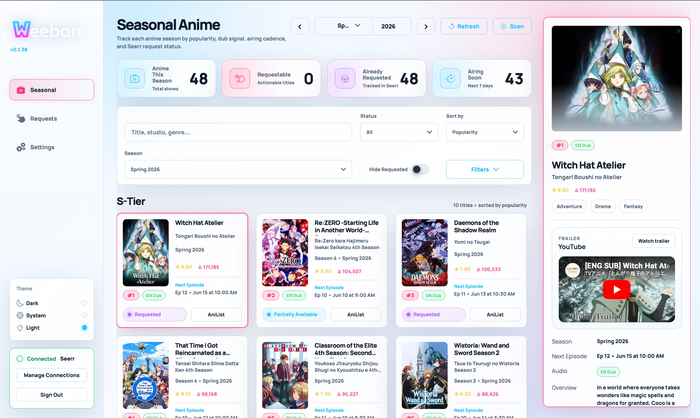
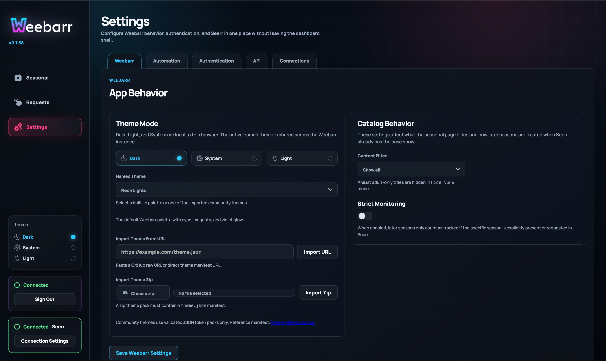

# Weebarr Wiki

Welcome to the Weebarr wiki.

Weebarr is a seasonal anime dashboard for people who run their own media setup. It helps you see what is airing, check what you already have or requested through Seerr, and request new anime without bouncing between a bunch of different tabs.

You do not need to understand every setting before using it. Start with the deployment guide for your system, connect Weebarr to Seerr, then use the Seasonal page as your main dashboard.

## Interface Preview

## What Weebarr Does

Weebarr brings together:

- seasonal anime information from AniList
- request and availability status from Seerr
- anime request settings that flow through Seerr into Sonarr
- a simple login system
- optional Plex auth login
- themes
- optional automation for requesting seasonal anime by bucket

In plain English: Weebarr helps you answer, “What anime is airing, do I already have it, and should I request it?”

## Downloads and Links

- [GitHub Repository](https://github.com/DeepDaddyTTV/weebarr)
- [GitHub Pages Docs](https://deepdaddyttv.github.io/weebarr/)
- [Docker Hub Image](https://hub.docker.com/repository/docker/deepdaddyttv/weebarr/general)

## Pages in This Wiki

- [Features](Features.md)  
  Learn what each main page in Weebarr does.

- [Settings](Settings.md)  
  Understand the Settings page without needing to guess what each toggle means.

- [Theme Template](Theme-Template.md)  
  Use the reference theme manifest and sample JSON to build your own themes.

- [Docker Desktop on Windows](Deployment-Docker-Desktop-Windows.md)  
  Recommended if you are running Weebarr on a Windows machine with Docker Desktop.

- [Docker Desktop on Linux](Deployment-Docker-Desktop-Linux.md)  
  Recommended if you are running Docker Desktop on Linux.

- [Docker Hub](Deployment-Docker-Hub.md)  
  Use the published Docker Hub image directly if that is your preferred registry.

- [Other Deployment Options](Deployment-Other-Options.md)  
  For Docker Engine, Portainer, reverse proxies, Cloudflare Tunnel, custom images, and development use.

- [Troubleshooting](Troubleshooting.md)  
  Start here when something does not connect, request, import, or display correctly.

- [API Reference](API-Reference.md)  
  For users who want to connect health checks, automation, or external tools.

## Recommended Setup Path

If this is your first time setting up Weebarr, use this order:

1. Pick one deployment guide:
   - [Docker Desktop on Windows](Deployment-Docker-Desktop-Windows.md)
   - [Docker Desktop on Linux](Deployment-Docker-Desktop-Linux.md)
   - [Docker Hub](Deployment-Docker-Hub.md)
   - [Other Deployment Options](Deployment-Other-Options.md)
2. Start Weebarr and complete the first-run setup.
3. Go to **Settings**.
4. Open the **Connections** tab.
5. Add your Seerr URL and API key.
6. Use the connection test.
7. Open the **Seasonal** page.
8. Request titles manually, or enable automation later after you understand the buckets.

## Main Ideas

### Seasonal

The Seasonal page is the main screen. It shows current or selected seasonal anime and groups them into buckets such as `S-Tier`, `Canon`, `Bingeable`, and `Filler`.

### Requests

The Requests page only shows requests made through Weebarr. It is not meant to replace your full Seerr request history.

### Availability

Weebarr checks Seerr and tries to show whether a title is already available, already requested, partly available, missing, or not matched.

### Automation

Automation can request shows for you based on the buckets you choose. It intentionally skips titles that are already requested or already available.

### Settings

Settings control themes, content filtering, automation, login options, API-key access, and how Weebarr talks to Seerr.

## Before You Start

You should already have:

- Docker or Docker Desktop
- a working Seerr instance
- a Seerr API key
- Sonarr connected to Seerr if you want requests to become Sonarr entries
- a folder where Weebarr can save its config

Your config folder matters. Keep it mounted and backed up. That is where Weebarr stores its settings, request history, theme imports, automation history, API key state, and login setup.
